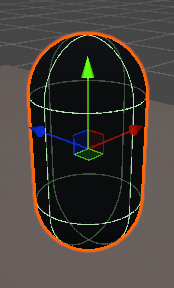
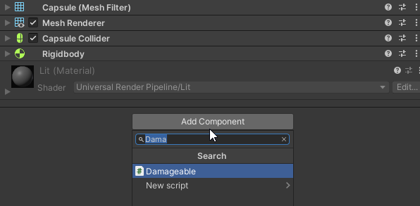
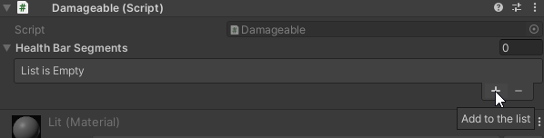
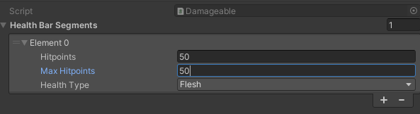

Here's a handy contents page for you:

- [Notes before you start reading](#notes-before-you-start-reading)
- [Using the damage system](#using-the-damage-system)
  - [How does this system work?](#how-does-this-system-work)
  - [How do I use it?](#how-do-i-use-it)
    - [Final code](#final-code)
- [Adding damage types, health types, and reactions](#adding-damage-types-health-types-and-reactions)
  - [What are the rules for adding reactions?](#what-are-the-rules-for-adding-reactions)
- [The `Damageable` class](#the-damageable-class)
  - [Supported operations](#supported-operations)
  - [Constructors](#constructors)
  - [Properties](#properties)
  - [Methods](#methods)
    - [`Damage(float amount, Damage damageType)`](#damagefloat-amount-damage-damagetype)
    - [`Heal(float amount)`](#healfloat-amount)
    - [`Scale(float multiplier)`](#scalefloat-multiplier)
    - [`ScaleMaxHitpoints(float multiplier)`](#scalemaxhitpointsfloat-multiplier)
    - [`ScaleCurrentHitpoints(float multiplier)`](#scalecurrenthitpointsfloat-multiplier)
    - [`Append(HealthBarSegment segment)`](#appendhealthbarsegment-segment)
    - [`RemoveLast()`](#removelast)
- [The `HealthBarSegment` class](#the-healthbarsegment-class)
  - [Supported operations](#supported-operations-1)
  - [Constructors](#constructors-1)
    - [`new HealthBarSegment(Health healthType, float hitpoints)`](#new-healthbarsegmenthealth-healthtype-float-hitpoints)
    - [`new HealthBarSegment(Health healthType, float hitpoints, float maxHitpoints)`](#new-healthbarsegmenthealth-healthtype-float-hitpoints-float-maxhitpoints)
  - [Properties](#properties-1)
  - [Methods](#methods-1)
    - [`Scale(float multiplier)`](#scalefloat-multiplier-1)
    - [`ScaleMaxHitpoints(float multiplier)`](#scalemaxhitpointsfloat-multiplier-1)
    - [`ScaleCurrentHitpoints(float multiplier)`](#scalecurrenthitpointsfloat-multiplier-1)
    - [`Set(HealthBarSegment segment)`](#sethealthbarsegment-segment)
- [The `DamageInfo` struct](#the-damageinfo-struct)
  - [Constructors](#constructors-2)
    - [`new DamageInfo()`](#new-damageinfo)
    - [`new DamageInfo { ... }` (object initializer)](#new-damageinfo----object-initializer)
  - [Fields](#fields)

# Notes before you start reading
In several places throughout this guide, I use `... snip` comments. These essentially just mean "the code here isn't
what you should be focusing on for this part of the example, so I'm using this comment to hide it." Your code shouldn't
have these comments, and you can just ignore them. They're just there to make reading things a little easier!

# Using the damage system

## How does this system work?
The damage system is comprised of a few fundamental pieces:
- The `Damageable` script itself
- Health segments
- Health types
- Damage types
- Reactions

I won't go into the specifics here, but for now what you need to know is that if you have a GameObject with the
`Damageable` script attached, you can heal or damage it. Each `Damageable` has one or more *health segments*. These are
the individual pieces of the healthbar. Each one has a certain amount of hitpoints, maximum hitpoints, and an associated
*health type*. A health type is something along the lines of `Flesh` or `Armour`, and is used as part of a reaction when
damage gets dealt. Damage types - such as `Fire` or `Slash` are similar - and get used for the same purposes. Reactions
are the last piece of the puzzle, and they're what changes how different damage and health types interact. Reactions are
what allow you to make `Magic` damage to more actual damage to `Armour`, for example. They're entirely customisable and
you can change how they behave.

When it comes to creating your own reactions, health types, and damage types, I'll explain all of that in just a bit.
Alternatively, you can go back to the contents and look there. It'll have quick links to the relative section.

## How do I use it?
Let's write a script for a simple enemy that will take 10 damage every time it gets hit with something tagged
`PlayerWeapon`, and delete the GameObject when it dies.

First things first, we need to add a `using` directive so that all the `DamageSystem` classes can be used. We'll add
what we need from Unity as well!
```cs
using DamageSystem;
using UnityEngine;
```
Now we can write out the skeleton of our script. Unity usually generates this for you when you create a new script so
that you don't need to type it all out manually. Thankfully, a script skeleton is pretty simple!
```cs
public class SimpleEnemy : MonoBehaviour
{
    private void Start()
    {

    }

    private void Update()
    {

    }
}
```
Next, we need to add the variables our enemy will use to its class. In our case, this is pretty simple, since we just
need the `Damageable` script. While we're here, we'll also add the `RequireComponent` attribute to our enemy script, so
that somebody can't accidentally make an enemy without adding the `Damageable` script to it. Our code will now look a
bit like this:
```cs
[RequireComponent(typeof(Damageable))]
public class SimpleEnemy : MonoBehaviour
{
    private Damageable _health;

    // ... snip
}
```
`[RequireComponent(typeof(Damageable))]` looks scary, but it's just used to tell Unity that this script *needs* the
`Damageable` script to work. If somebody tries to attach the `SimpleEnemy` class to a GameObject without the
`Damageable` script, Unity will attach it automatically for us.

The next thing we need to do is assign the value of `_health`. If we didn't do that, whenever we tried to use the
`_health` variable we would get a `NullReferenceException`. Doing this is pretty simple!
```cs
[RequireComponent(typeof(Damageable))]
public class SimpleEnemy : MonoBehaviour
{
    private Damageable _health;

    private void Start()
    {
        _health = GetComponent<Damageable>();
    }

    // ... snip
}
```
Now that that's done, we need to actually *do* something with it. Let's add the collision logic!
We'll use Unity's `OnCollisionEnter` method for this, which gets called every time a RigidBody collides with another
RigidBody or collider<sup>1</sup>. We'll also use the `Damageable.Damage` method to actually *do* damage.

Here's what our script looks like now
```cs
[RequireComponent(typeof(Damageable))]
public class SimpleEnemy : MonoBehaviour
{
    // ... snip

    private void OnCollisionEnter(Collision other)
    {
        if (other.gameObject.CompareTag("PlayerWeapon"))
        {
            _health.Damage(10, Damage.Slash);
        }
    }
}
```

<sup>1</sup>: Technically, it's whenever any two colliders collide, but the event is only sent if one of the
two colliders has a rigidbody attached. Unity explains this more at
<https://docs.unity3d.com/ScriptReference/Collider.OnCollisionEnter.html>.

But well.. isn't something wrong here? What happens when we run out of health? How much health do we even have? And
you're right! Something is indeed wrong. We haven't set *any* of that up.

Do not despair, though! It's easy to get it all working.

The first step is to actually add an event that gets run *when* we run out of health. Let's go back to our start method:
```cs
[RequireComponent(typeof(Damageable))]
public class SimpleEnemy : MonoBehaviour
{
    // ... snip

    private void Start()
    {
        _health = GetComponent<Damageable>();
    }

    // ... snip
}
```
We're gonna update this `Start` method, so that it registers an event that will destroy this `GameObject` when we run
out of health. If you've used the new input system, this will be very familiar!
```cs
[RequireComponent(typeof(Damageable))]
public class SimpleEnemy : MonoBehaviour
{
    // ... snip

    private void Start()
    {
        _health = GetComponent<Damageable>();
        _health.OnDeath += () =>
        {
            Destroy(gameObject);
        };
    }

    // ... snip
}
```
`Damageable.OnDeath` is an event that gets called when we, well.. die. We use `+=` to attach a callback that will be
executed when our script receives the event. In our case, this is really simple! When we've run out of health, we'll
just destroy the GameObject. Easy!

Now it's time to set it up in the inspector. I've added a Capsule from the `3D Object` -> `Capsule` menu, and it comes
with a collider already.



Then I'll add a RigidBody so that collisions work, and after that I'll add the `Damageable` script.



You can see here I'm using search. This is to make our lives easier. It saves us from going digging for a script inside
the project.

After that's done, it's time to add some segments to our healthbar! We'll just start off by giving our enemy 50 `Flesh`
health. To do that, we need to find our `Damageable` in the inspector, and add an item:



Then we click the arrow on "Element 0" to expand it, and set its hitpoints to what we want:



Now you can attach your `SimpleEnemy` script, and you're done! You have something that can take damage and.. die. In a
real situation, you'll need to add some more code here and there, and it'll differ for each use. But hopefully this
helps you get down the basics!

### Final code
You should have something similar to the below:
```cs
using DamageSystem;
using UnityEngine;

[RequireComponent(typeof(Damageable))]
public class SimpleEnemy : MonoBehaviour
{
    private Damageable _health;

    private void Start()
    {
        _health = GetComponent<Damageable>();
        _health.OnDeath += () =>
        {
            Destroy(gameObject);
        };
    }

    private void OnCollisionEnter(Collision other)
    {
        if (other.gameObject.CompareTag("PlayerWeapon"))
        {
            _health.Damage(10, Damage.Slash);
        }
    }
}
```

# Adding damage types, health types, and reactions
Inside `Scripts/DamageSystem.cs`, there are two enums and a class. These are what you use to configure damage/health
types and their reactions.

To add a health type, you just need to add to the `Health` enum.
```cs
public enum Health
{
    Flesh,
    Armour,
    ElementalArmour,
    // <- Add your health type here! Make sure each word in the name is capitalised, and don't forget a comma.
}
```
It's the same for adding damage types. You just need to add to the `Damage` enum.
```cs
public enum Damage
{
    Slash,
    Impact,
    Puncture,
    Fire,
    Water,
    Air,
    Earth,
    Lightning,
    // <- Add your damage type here! Make sure each word in the name is capitalised, and don't forget a comma.
}
```

Adding reactions is slightly more complex, but is still straightforward. Essentially, you add a method with the
`Reaction` attribute to the `Reactions` class, and then that method will be called as necessary. That sounds a bit
complex, but it just looks like this in the end:
```cs
[Reaction(Health.Armour, Damage.Impact, Damage.Slash)]
// ^^^^^^ Reaction defined here
public DamageInfo ArmourResistance(float damageAmount) => new DamageInfo
{
    Amount = damageAmount * 0.5f,
    Capped = false
};
```
This defines a reaction between the `Armour` health type, and the `Impact` and `Slash` damage types.

Each of these methods return an instance of the `DamageInfo` class, which allows you to decide how much damage is
actually *done* and whether it's capped or not. "Capping" sounds a bit strange, but is really simple at the end of the
day. Say you have an enemy with 400 points of `Flesh` health, and 400 points of `Armour` health. If `Capped` is true,
and you deal 600 points of damage, it will just get rid of those 400 points of `Armour` health, and won't bleed into the
enemy's `Flesh` health at all. But if `Capped` is false, that damage *will* bleed through, and that enemy will be left
with 200 points of `Flesh` health. It's pretty much like shield gating, if you're familiar with that.

**Note**: I've used C#'s expression method syntax here for brevity, which might be a bit confusing. Essentially, it's equivalent
to this:
```cs
[Reaction(Health.Armour, Damage.Impact, Damage.Slash)]
// ^^^^^^ Reaction defined here
public DamageInfo ArmourResistance(float damageAmount)
{
    return new DamageInfo
    {
        Amount = damageAmount * 0.5f,
        Capped = false
    };
}
```

## What are the rules for adding reactions?
**You can define a reaction between one health type and as many damage types as you'd like.** The rules are as follows:
- You cannot use 0 damage types
- You cannot use 0 health types
- You cannot use more than 1 health type.

Valid reactions:
- `[Reaction(Health.Armour, Damage.Impact)]` (1 health type, 1 damage type)
- `[Reaction(Health.Armour, Damage.Impact, Damage.Slash, Damage.Puncture)]` (1 health type, 3 damage types)

Invalid reactions:
- `[Reaction(Health.Armour, Health.Flesh, Damage.Impact)]` (2 health types, 1 damage type)
- `[Reaction(Damage.Impact)]` (0 health types, 1 damage type)
- `[Reaction()]` (0 health types, 0 damage types)

# The `Damageable` class
The `Damageable` class is used to represent any `GameObject` that has hitpoints and can be damaged.

## Supported operations
| Operation                                          | Description                                                     |
| -------------------------------------------------- | --------------------------------------------------------------- |
| `damageable[int i]`                                | Returns the healthbar segment at index `i`                      |
| `foreach (HealthBarSegment segment in damageable)` | Enumerates through all `HealthBarSegment`s in this `Damageable` |

## Constructors
`Damageable` is a `MonoBehaviour`, so it should only be created by using `AddComponent<Damageable>()` or retrieved
using `GetComponent<Damageable>()`.

## Properties
| Name            | Type    | Description                             |
| --------------- | ------- | --------------------------------------- |
| `CurrentHealth` | `float` | The current health of this `Damageable` |
| `MaximumHealth` | `float` | The maximum health of this `Damageable` |

## Methods

### `Damage(float amount, Damage damageType)`
Deal `amount` hitpoints of damage to this `Damageable`. Reactions will be made using the value of the `damageType`
argument.

### `Heal(float amount)`
Heal this `Damageable` by `amount` hitpoints. Using this method will **not** cause the current hitpoints to exceed the
maximum.

### `Scale(float multiplier)`
Scale the maximum and current hitpoints of this `Damageable` by `multiplier`.

### `ScaleMaxHitpoints(float multiplier)`
Scale the maximum hitpoints of this `Damageable` by `multiplier`. This will *not* scale this `Damageable`'s current
hitpoints.

### `ScaleCurrentHitpoints(float multiplier)`
Scale the hitpoints of this `Damageable` by `multiplier`. This will *not* scale this `Damageable`'s maximum
hitpoints. 

### `Append(HealthBarSegment segment)`
Add a new healthbar segment to this `Damageable`.  
If `segment` is `null`, this throws `ArgumentNullException`.

### `RemoveLast()`
Remove the last healthbar segment from this `Damageable`.
If there is only 1 healthbar segment, this will throw `ArgumentOutOfRangeException`.

# The `HealthBarSegment` class
The `HealthBarSegment` class represents a single segment of a health. Each `HealthBarSegment` is comprised of its
current hitpoints, its maximum hitpoints, and an associated health type. 

**Note**: You cannot damage or heal an individual `HealthBarSegment`. Use the methods provided by
[`Damageable`](#the-damageable-class) instead.

## Supported operations
| Operation                                     | Description                                                               |
| --------------------------------------------- | ------------------------------------------------------------------------- |
| `HealthBarSegment segment * float multiplier` | Scales the current and maximum hitpoints of this segment by `multiplier`. |

## Constructors
This class has 2 public constructors.

### `new HealthBarSegment(Health healthType, float hitpoints)`
Create a new `HealthBarSegment` with health type `healthType`, and current/maximum hitpoints set to `hitpoints`.

### `new HealthBarSegment(Health healthType, float hitpoints, float maxHitpoints)`
Create a new `HealthBarSegment` with health type `healthType`, current hitpoints set to `hitpoints`, and a maximum
hitpoints of `maxHitpoints`.

## Properties
| Name            | Type     | Description                                   |
| --------------- | -------- | --------------------------------------------- |
| `CurrentHealth` | `float`  | The current health of this `HealthBarSegment` |
| `MaximumHealth` | `float`  | The maximum health of this `HealthBarSegment` |
| `HealthType`    | `Health` | The health type of this `HealthBarSegment`    |


## Methods

### `Scale(float multiplier)`
Scale the maximum and current hitpoints of this `HealthBarSegment` by `multiplier`.

### `ScaleMaxHitpoints(float multiplier)`
Scale the maximum hitpoints of this `HealthBarSegment` by `multiplier`. This will *not* scale this `HealthBarSegment`'s
current hitpoints.

### `ScaleCurrentHitpoints(float multiplier)`
Scale the hitpoints of this `HealthBarSegment` by `multiplier`. This will *not* scale this `HealthBarSegment`'s maximum
hitpoints.

### `Set(HealthBarSegment segment)`
Set all values in this `HealthBarSegment` to those from `segment`.

# The `DamageInfo` struct
The `DamageInfo` struct is a simple data type used to convey information as part of reactions. Refer to
[this section](#adding-damage-types-health-types-and-reactions) for more information on how this type is used.

## Constructors
`DamageInfo` is a struct, so it has a default constructor. All fields are public, so you can also use an object
initializer.

### `new DamageInfo()`
This is the default constructor, and will create a `DamageInfo()` with `Capped` set to `false` and `Amount` set to 0.

### `new DamageInfo { ... }` (object initializer)
All fields are public, so the object initializer can be used. An example can be seen below:
```cs
new DamageInfo
{
    Amount = 50f,
    Capped = true
}
```
You can specify the values for as many or as little fields as you'd like. If the values for any fields are not specified, the values from
the default constructor will be used instead. This means that `Amount` defaults to 0 and `Capped` defaults to `false`.

## Fields
| Name     | Type    | Description                                                  |
| -------- | ------- | ------------------------------------------------------------ |
| `Amount` | `float` | The  amount of damage to deal, in hitpoints                  |
| `Capped` | `bool`  | Whether damage will bleed through to the next health segment |
